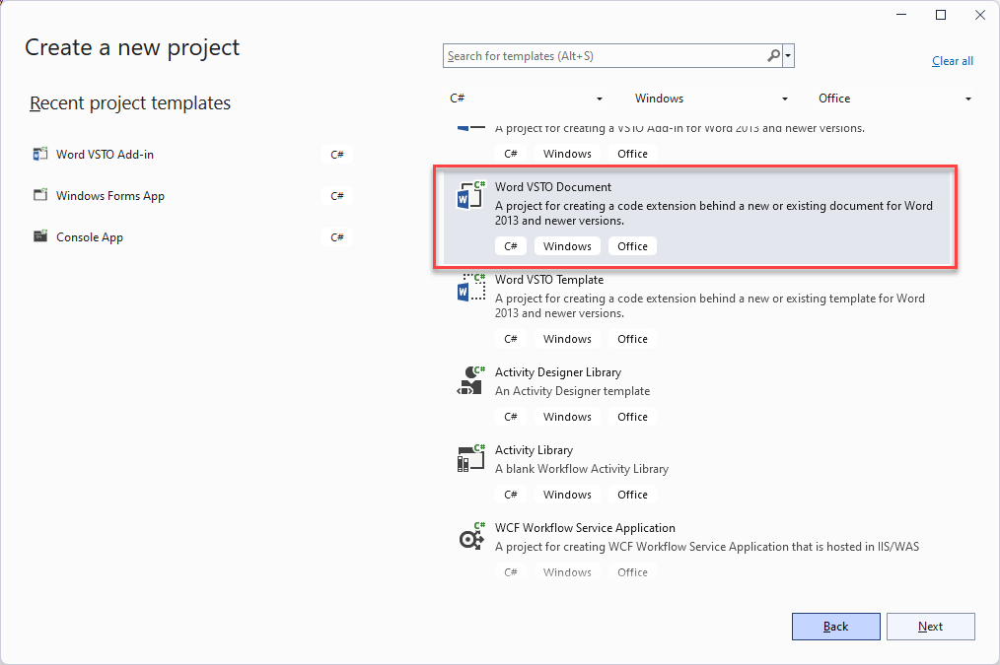
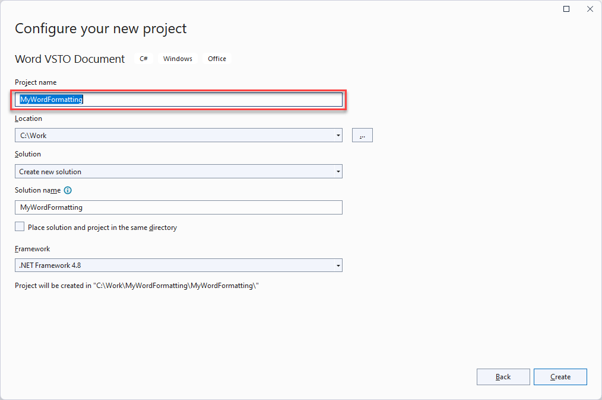
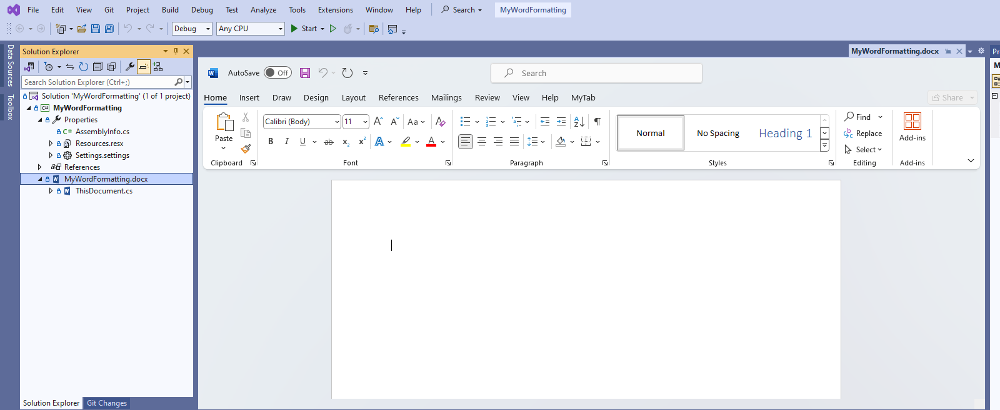
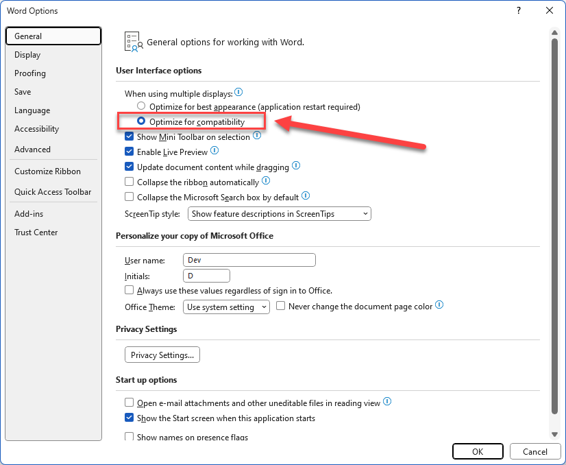

# MyWordFormatting
This project shows you how to create a VSTO Document for Microsoft Office Word.

## Summary
This project was created by following **[Walkthrough: Change document formatting using CheckBox controls](https://learn.microsoft.com/en-us/visualstudio/vsto/walkthrough-changing-document-formatting-using-checkbox-controls?view=vs-2022&tabs=csharp)**.

## Create the project
To create a new Word VSTO Document project in Visual Studio:
1. Start `Visual Studio 2022`.
2. On the File menu, point to New, and then click Project.
3. In the templates pane, expand `Visual C#`, and then expand `Office`.
4. In the list of project templates, select a `Word VSTO Document` project.
  
5. In the Name box, type **MyWordFormatting**.
  
6. Click OK.

Visual Studio creates the **MyWordFormatting** project.
Please double-click `MyWordFormatting.docx` file and opens it in the Designer.

If the document file (.docx) isn't shown in the Designer of Visual Studio, please do following:
1. Run the Word application.
2. Open File -> Options window.
3. Select `General` tab.
4. Select `Optimize for compatibility` option.
  
5. Click `OK` button and close the Word application.
6. Reload the Designer in the Visual Studio.
